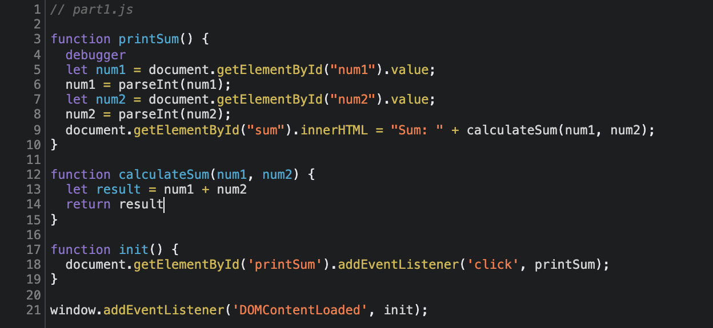

# DevTools - Debugging

1. The variables `num1` and `num2` are parsed as strings. Then, the addition operation is the string concatenation. 
2. I add `num1 = parseInt(num1)` and `num2 = parseInt(num2)` for the type conversion. 
